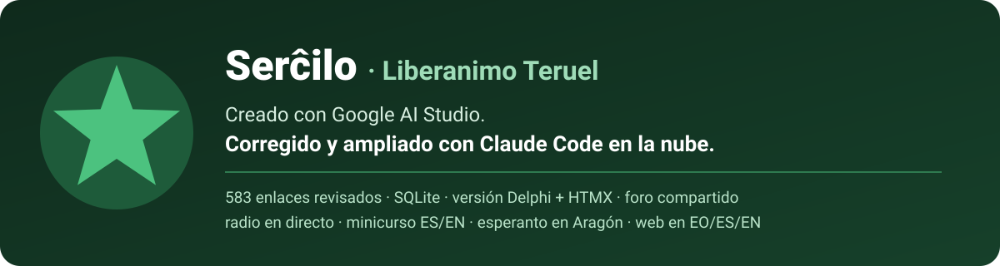

# Serĉilo

Search engine for Esperanto resources by **Liberanimo Teruel**. The app was created with
Google AI Studio and later fixed and extended with Claude Code on the web: SQLite
database, Delphi version, reviewed links, shared forum, mini-course and more (see
[Historia del proyecto](#historia-del-proyecto)).

This contains everything you need to run your app locally.

View your app in AI Studio: https://ai.studio/apps/1f685933-e473-4c77-9a87-e5e3f760bab5

## Run Locally

**Prerequisites:**  Node.js

1. Install dependencies:
   `npm install`
2. Set the `GEMINI_API_KEY` in [.env.local](.env.local) to your Gemini API key
3. Run the app:
   `npm run dev`

Node.js 22.13 or later is required (the server uses the built-in `node:sqlite`).

## Data: SQLite database

The Esperanto resources ("links") and the knowledge panels live in the SQLite
database [`data/serchi.db`](data/serchi.db) (schema in [`data/schema.sql`](data/schema.sql)).
The Express server reads it and exposes it to the React app:

| Method | Route | |
|---|---|---|
| GET | `/api/resources` | all resources |
| GET | `/api/knowledge` | knowledge panels |
| POST | `/api/resources` | add one resource (409 if the URL already exists) |
| POST | `/api/resources/batch` | add several resources, skipping duplicates |

The forum is in the same database: topics, replies and likes are saved there and
shared by every visitor.

| Method | Route | |
|---|---|---|
| GET | `/api/forum` | all topics and replies |
| POST | `/api/forum/topics` | new topic |
| POST | `/api/forum/topics/:id/comments` | reply |
| POST | `/api/forum/topics/:id/like` · `/api/forum/comments/:id/like` | like / unlike |
| POST | `/api/forum/topics/:id/pin` · `/api/forum/topics/:id/lock` | moderators: pin, lock |
| DELETE | `/api/forum/topics/:id` · `/api/forum/comments/:id` | moderators: delete |

Visitors post as one of the forum's demo users (learner, teacher or moderator). Set
`FORUM_MODERATOR_KEY` in `.env.local` so that the moderator role asks for that key;
without it, anyone can moderate.

Resources added from the web are saved in the database, so every visitor sees them.
Set `SERCHI_DB=/path/to/file.db` to use another database file (for example, so
testing does not modify the committed one).

Scripts:

- `npm run db:import -- --resources links.json [--knowledge panels.json] [--source curated|user|crawled] [--reset]`:
  loads a JSON array of resources into the database, skipping duplicated URLs. This
  is the script that migrated the original `src/data/*.ts` files to SQLite (see the
  comment at the top of [`scripts/db-import.ts`](scripts/db-import.ts)).
- `npm run db:export -- [--out dir]`: dumps the database to `resources.json` and
  `knowledge.json` (default `data/export/`), handy for reviewing or editing by hand.
- `npm run forum:import -- [--file forum.json]`: replaces the whole forum with the
  content of a JSON file (default: the demo forum in
  [`data/imports/2026-09-foro-inicial.json`](data/imports/2026-09-foro-inicial.json)).
- `npm run links:check -- [--category radio] [--out report.md]`: opens every URL in
  the database (links, knowledge panel links and radio feeds) and writes a report of
  the broken, blocked and redirected ones (default
  `data/audits/<date>-comprobacion-enlaces.md`). Exits with code 1 if some URL is
  broken. Behind a proxy, run it with `NODE_USE_ENV_PROXY=1`.

## Delphi + WebStencils + HTMX version

The [`delphi/`](delphi/README.md) folder contains a server-rendered version of the same
site built with Delphi WebBroker, WebStencils templates and HTMX. It reads the same
SQLite database, forum included; UI translations and search synonyms are exported to
JSON with `npm run export:delphi`.

## Historia del proyecto

Serĉilo es un buscador de recursos en esperanto (cursos, diccionarios, noticias,
literatura, radio, comunidad…) de **Liberanimo Teruel**, el grupo esperantista de
Teruel. Todo lo que sigue ocurrió el 27 de septiembre de 2026; entre paréntesis, los
PR y commits correspondientes.

1. **Origen en Google AI Studio** (`29f5106`, `e2b5c87`). Antonio Alcázar crea la
   aplicación con AI Studio: una web React + Vite, con un servidor Express que usa
   Gemini con búsqueda de Google para descubrir enlaces en vivo. Incluye 300 recursos
   en ficheros TypeScript, paneles de conocimiento, un foro simulado, favoritos y la
   interfaz en esperanto, español e inglés.
2. **Puesta a punto para ejecutarla en local**
   ([#1](https://github.com/miteruel/serchi/pull/1)). Se corrigen un conflicto de
   dependencias de esbuild y la carga de `.env.local`.
3. **Versión Delphi + WebStencils + HTMX**
   ([#2](https://github.com/miteruel/serchi/pull/2)). Se añade en [`delphi/`](delphi/README.md)
   una segunda versión del sitio, renderizada en el servidor con Delphi WebBroker y
   plantillas WebStencils, y con HTMX para la búsqueda en vivo, el foro y los
   favoritos, sin React.
4. **Identidad de Liberanimo Teruel**
   ([#3](https://github.com/miteruel/serchi/pull/3)). El logotipo del grupo sustituye a
   la estrella genérica y la web indica expresamente que es de Liberanimo Teruel, en
   los tres idiomas.
5. **Migración de los datos a SQLite**
   ([#4](https://github.com/miteruel/serchi/pull/4)). Los enlaces y los paneles pasan de
   los ficheros `.ts` a `data/serchi.db`, que comparten las versiones Node y Delphi. La
   migración se hizo con `scripts/db-import.ts`, que queda como herramienta de carga.
   En el proceso apareció un enlace duplicado (Reddit r/Esperanto), así que quedaron 299.
6. **Ampliación a más de 500 enlaces** (`7b9ecf3` … `11473ff`). Se añaden 204 enlaces
   en cuatro tandas (`data/imports/2026-09-enlaces-*.json`), con especial atención a
   cursos, herramientas, literatura y recursos en español, incluidos artículos sobre la
   historia del esperanto en Teruel y Aragón. Cada URL se tomó de resultados reales de
   búsqueda web; ninguna se escribió de memoria.
7. **Sección de radio con reproductor en línea** (`17a84c9`). Nueva categoría *Radio*
   con 36 emisoras y programas (hoy 34, tras la revisión del paso 8: Muzaiko, Pola Retradio, Radio Vaticano, 3ZZZ, Radio
   Havano Kubo, China Radio International, Radio Brazila Esperanto…). Las que tienen
   una fuente verificada se pueden escuchar sin salir de la web:
   - reproductores oficiales de Spotify y Zeno.FM;
   - feeds de pódcast leídos por el servidor.

   La barra del reproductor sigue sonando mientras se navega.

8. **Revisión de los enlaces originales.** Los 299 enlaces heredados de AI Studio se
   comprobaron uno a uno con búsquedas restringidas a su dominio. Resultado:
   - 113 correctos;
   - 67 con la dirección corregida;
   - 73 eliminados: no existían, estaban duplicados o sus dominios ya no son de
     esperanto (spam, un gimnasio, una web de apuestas…);
   - 46 pendientes de revisar, que se revisaron después (paso 9).

   El detalle está en [`data/audits/2026-09-revision-enlaces-originales.md`](data/audits/2026-09-revision-enlaces-originales.md).
   De paso se añadieron 35 enlaces reales encontrados durante la revisión
   (`data/imports/2026-09-enlaces-5.json`), entre ellos dos noticias sobre la app de
   Liberanimo. La base de datos queda con 489 enlaces.

9. **Fin de la revisión y sección de juegos.** Se revisaron los 46 enlaces pendientes:
   5 correctos, 25 con la dirección corregida y 16 eliminados. En los corregidos
   también se reescribieron el título y la descripción con los datos de las fuentes. El
   balance final de los 299 enlaces originales es de 118 correctos, 92 corregidos y 89
   eliminados. Además se añadieron 24 enlaces sobre juegos en esperanto
   (`data/imports/2026-09-juegos.json`): catálogos de videojuegos (itch.io, Steam,
   Videoludoj.com), juegos de palabras (Wordle, Vortludo Rapida, los juegos de hVortaro),
   juegos de tablero (Skrablo, LinguaPolis, Vetveturistoj, Tabuo), traducciones de
   aficionados (Super Mario Bros., Wesnoth, el manual de *Keep Talking and Nobody
   Explodes*) y el club de ajedrez esperantista de Chess.com. La base de datos queda con
   497 enlaces.

10. **Sección de esperantistas célebres.** Nueva categoría *Personas* (`people`, esquema
    v2 de la base de datos; `server/db.ts` migra solo las bases de datos antiguas) con
    33 fichas (`data/imports/2026-09-personas.json`): Zamenhof y su hija Lidia, autores
    como Baghy, Kalocsay, Auld, Marjorie Boulton, Piron o Spomenka Štimec, el Nobel
    Reinhard Selten, figuras del esperanto en España (Julio Mangada, Juan Régulo Pérez,
    Vicente Inglada) y en Aragón (Emilio Gastón, Pedro Ramón y Cajal y el turolense
    Julio Belenguer). La portada muestra las 12 destacadas y al pulsar en una se busca
    todo lo relacionado con ella. Julio Belenguer, Julio Baghy, William Auld, Claude
    Piron y Tibor Sekelj tienen además panel de conocimiento. Está también en la versión
    Delphi. La base de datos queda con 528 enlaces y 10 paneles.

11. **Sección de eventos.** Nueva categoría *Eventos* (`events`, esquema v3), separada de
    *Comunidad*, que pasa a llamarse solo así. Reúne 33 congresos, festivales y
    encuentros: 22 nuevos (`data/imports/2026-09-eventos.json`) y 11 que ya estaban en
    otras categorías (el Congreso Universal, SES, IJF, NASK, Eventa Servo…). Entre los
    nuevos, el Congreso Universal de 2027 en Melbourne, el IJK, el JES, el Congreso
    Español, el 41.º Congreso Catalán (Reus, octubre de 2026), ARKONES, KEF, los
    congresos continentales, el Congreso Español de 2017 en Teruel y las actividades de
    Frateco en Zaragoza. La portada muestra los 12 destacados, que enlazan a su web. La
    base de datos queda con 550 enlaces.

12. **Rincón infantil.** Nueva categoría *Niños* (`kids`, esquema v4) con 23 recursos
    para niños y familias: 18 nuevos (`data/imports/2026-09-ninos.json`) y 5 que ya
    estaban en otras categorías. Hay canciones infantiles (Babelo Filmoj, *Dek bovinoj*),
    cuentos y libros gratuitos (*Fabeloj de Andersen* traducidos por Zamenhof, *Alicio en
    Mirlando*, *La eta princo*, *Pipi Ŝtrumpolonga*, *Kumeŭaŭa*), el congreso infantil
    IIK, el encuentro de familias REF, el wiki *Familioj*, los juegos de Ŝnufido y apps y
    cursos para niños. La portada muestra los 12 destacados. La barra de categorías se
    ha compactado para que quepan las 12 pestañas. La base de datos queda con 568
    enlaces.

13. **Minicurso «Esperanto en 7 tagoj».** Un curso para niños y familias en siete
    lecciones, con explicaciones en español, dibujos sencillos, vocabulario, ejercicios
    con soluciones y un reto diario. Al marcar los siete días aparece un diploma con el
    nombre del niño (se guarda solo en su navegador). Es una página independiente,
    [`public/minikurso.html`](public/minikurso.html), enlazada desde el rincón infantil
    de la portada: la versión React la sirve en `/minikurso.html` y la Delphi en
    `/minikurso`.

14. **Historia del esperanto en Aragón.** Página [`public/historia-aragon.html`](public/historia-aragon.html)
    con una línea de tiempo desde 1905 hasta hoy. Recorre los pioneros (Julio Belenguer
    en Teruel, la fundación de Frateco en Zaragoza en 1908 y los grupos de Huesca), la
    guerra, los cuatro congresos españoles en Zaragoza, el Quijote en esperanto de 1977,
    el monumento de 2008 y la vuelta del esperanto a Teruel con Liberanimo. Cada hito
    enlaza a su fuente. Se añadieron 15 fuentes a la base de datos
    (`data/imports/2026-09-aragon.json`, etiqueta `aragono`) y un panel de conocimiento
    que aparece al buscar Aragón, Zaragoza, Huesca, Teruel o Frateco. La base de datos
    queda con 583 enlaces y 11 paneles. De paso se corrigió que en la versión Delphi el
    minicurso se viera sin estilos: la navegación con `hx-boost` de HTMX solo cargaba el
    `<body>` de la página. Ahora esos enlaces cargan la página completa y los estilos de
    ambas páginas están dentro del `<body>`.

15. **Estampa de Teruel y Liberanimo.** El minicurso y la historia de Aragón llevan una
    ilustración de Teruel: el casco viejo, el Torico con la estrella del escudo (que es
    también la estrella verde del esperanto), una torre mudéjar con cerámica verde y
    blanca y los cerros ocres. Va en una tarjeta con el logotipo y el nombre de
    Liberanimo (*libera animo*, «alma libre»). El logotipo va incrustado en las páginas
    para que se vea igual en las versiones React y Delphi.

16. **Teruel en la portada.** El dibujo de Teruel aparece también en la portada, bajo el
    nombre del sitio, y al pulsarlo se abre la historia del esperanto en Aragón. Está
    hecho con clases de Tailwind para seguir el modo claro u oscuro de la web
    (`src/components/TeruelSkyline.tsx` y, en Delphi, `delphi/templates/_teruel.html`).
    De paso, la columna de la portada se alinea arriba: al crecer con las nuevas
    secciones, el logotipo y el título quedaban tapados bajo la barra superior.

17. **Barra superior en móvil.** La barra superior de la versión React ya cabe en
    cualquier pantalla, de 320 a 1280 px de ancho, en la portada, los resultados y el
    foro. En móvil, las pestañas muestran solo su icono (con el nombre como texto
    accesible) y los enlaces externos y el texto de «Añadir enlace» aparecen solo en
    pantallas anchas. La fila de acciones de cada resultado también puede partirse en
    dos líneas.

18. **Menú de idioma en móvil.** El selector de idioma de la versión React se abría solo
    al pasar el ratón, así que en pantallas táctiles no funcionaba bien. Ahora se abre al
    tocarlo y se cierra al elegir un idioma, al tocar fuera o con Escape. En escritorio
    sigue abriéndose también al pasar el ratón.

19. **Comprobador de enlaces.** `npm run links:check` abre cada URL de la base de datos
    (enlaces, enlaces de los paneles de conocimiento y fuentes de radio) y escribe un
    informe en `data/audits/` con los rotos, los que no responden, los que bloquean las
    visitas automáticas y los que redirigen a otro dominio. No se ha podido ejecutar
    contra las webs reales desde el entorno de trabajo, que no tiene acceso a internet;
    se probó con un servidor local que imita cada caso.

20. **Foro en la base de datos.** El foro deja de guardarse en el navegador (React) o en
    memoria (Delphi): temas, respuestas y «me gusta» se guardan en `data/serchi.db`
    (tablas `forum_*`) y los ven todos los visitantes. Cada navegador puede dar un solo
    «me gusta» a cada mensaje. El foro de ejemplo pasa a
    `data/imports/2026-09-foro-inicial.json` y se carga con `npm run forum:import`. En
    la versión React, si se define `FORUM_MODERATOR_KEY`, el rol de moderador pide esa
    clave, ya que ahora sus acciones afectan a todos.

21. **Minicurso en inglés.** El minicurso «Esperanto en 7 tagoj» tiene ahora una versión
    con las explicaciones en inglés, [`public/minikurso-en.html`](public/minikurso-en.html),
    con los mismos dibujos y ejercicios. La tabla de pronunciación está rehecha para
    angloparlantes (vocales, `j`, `r`, `ĥ`…), y las lecciones explican lo que al inglés le
    cuesta: que el verbo no cambia con la persona y que el acusativo `-n` permite cambiar
    el orden de las palabras. Las dos versiones se enlazan entre sí, y la portada lleva a
    la inglesa cuando la web está en inglés (React en `/minikurso-en.html`, Delphi en
    `/minikurso-en`). El progreso y el diploma se comparten entre las dos versiones.

### Pendiente y limitaciones conocidas

- **Enlaces comprobados solo por búsqueda:** desde el entorno de trabajo no se pueden abrir
  las webs, así que cada enlace se dio por bueno cuando aparecía en resultados reales de
  búsqueda. Para abrirlos de verdad hay que ejecutar `npm run links:check` desde un
  ordenador con acceso a internet (paso 19); conviene repetirlo de vez en cuando.
- **Versión Delphi sin compilar:** no se ha compilado todavía con RAD Studio (ver
  [`delphi/README.md`](delphi/README.md)).
- **Moderación del foro en Delphi:** la versión Delphi todavía no pide la clave de
  moderador (`FORUM_MODERATOR_KEY`), así que allí cualquiera puede moderar.
